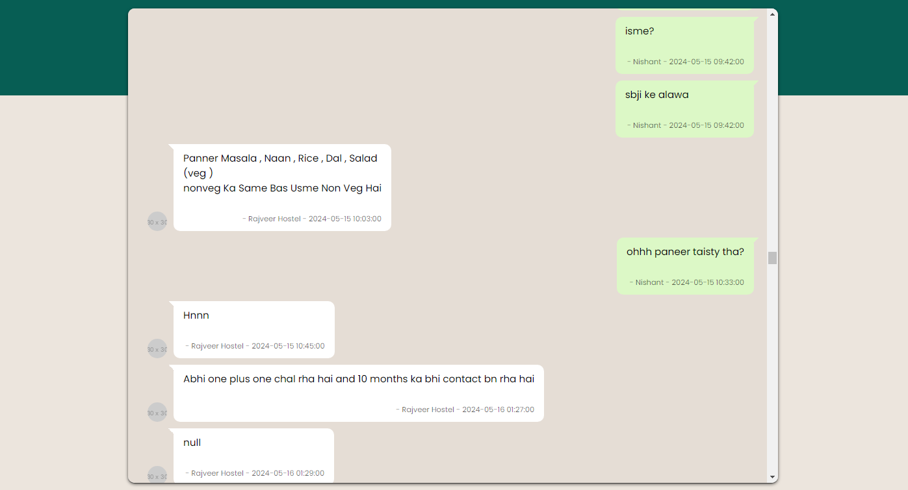
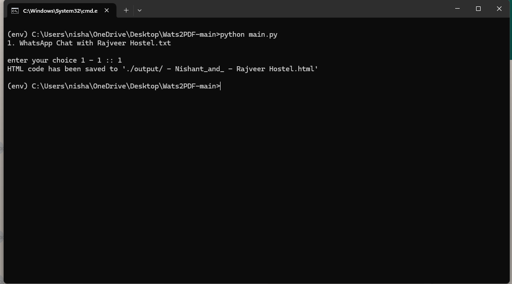

# WhatsApp Chat Export to HTML Converter

This project converts WhatsApp exported chat data (`.txt` files) without media into an HTML format, providing a user interface that resembles WhatsApp for easy viewing.

## Features

- Converts WhatsApp chat exports into a well-formatted HTML file.
- UI design mimics WhatsApp for a familiar viewing experience.
- organizes messages by user.

## Requirements

- Python 3.x
- Pandas library
- HTML templates for UI

## Installation

1. Clone this repository:

   ```bash
   git clone https://github.com/nishantssoni/Wats2Web.git
   ```

2. Navigate to the project directory:

   ```bash
   cd Wats2Web
   ```

3. Install the required Python libraries:

   ```bash
   pip install pandas
   ```

## Usage

1. Place your WhatsApp chat export `.txt` file in the project directory.

2. Run the script:

   ```bash
   python convert_chat.py
   ```

3. Follow the prompts to select the chat file and generate the HTML file.

## File Structure

- `convert_chat.py`: Main script to convert the chat data into HTML.
- `getDataFrame.py`: Module to read and process chat data.
- `utilityFunction.py`: Module for utility functions like file name retrieval.
- `htmlTemplate.py`: Module containing HTML templates for formatting messages.
- `output/`: Directory where the generated HTML files are saved.

## Screenshot

Below is a screenshot of the generated HTML file, which mimics the WhatsApp chat interface:




## Contributing

Feel free to open issues or submit pull requests if you have suggestions or improvements.

## License

This project is licensed under the MIT License. See the [LICENSE](./LICENSE) file for details.

## Contact

For any questions or feedback, please contact [iamnishantsoni4@gmail.com](mailto:iamnishantsoni4@gmail.com).
```